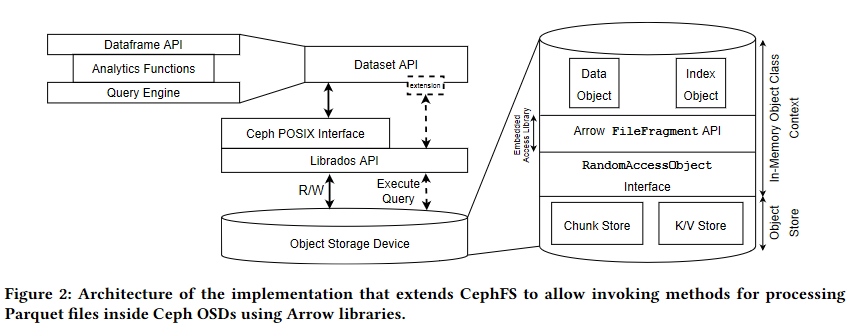

# Arrow

## Conditions
Theme: 'Universal Screwdrivers'
Event: [BLUG](https://www.meetup.com/belfast-lug/events/278413010/)
Time: '5-10mins' (take the 10)

## Free text

Evening folks, and I'm happy to be appearing in what we hope is the last virtual BLUG! We've all spent a long time toiling in our own little worlds in relative isolation over the course of this sequence of lockdowns, and its appropriate that now as we begin coming back together, that we're talking about projects that operate and complement across ecosystems. 

Now, as many of you might know, I've basically been a Python-only developer since my time at University; the strength of that ecosystem, with genre defining packages like `numpy`, `requests`, `pandas`, `beautifulsoup`, `scikit-learn`, `jupyter`, and `flask` mean that in my career as a Data Scientist, I rarely feel a strong need to leave my comfort zone for my own work and exploration.

However, in both my professional and hobbiest software engineering and data science projects, I occasionally have to deal with ... "Other People", and these other people have their own ecosystems that they think suit their workflows better; and, while they have every right to be mistaken, we generally have to shuffle small, medium, or depressingly large datasets around and between these vast programming language star systems like some kind of "No Mans Compiler".

So when Phil mentioned about the theme being about crossplatform libraries and workflows, there was only one candidate that I could suggest, and that is the [Apache Arrow](https://arrow.apache.org/) project.

On paper, and on spec, Arrow is fairly conventional as an in-memory data representation; it's got columnar storage for analytic lookups, leveraging CPU cache locality to maximise local throughput, with a fairly conventional bitmask/offset/value format for fast partial eliminations, and then these row-groups can be efficiently swapped in and out at will, or `mmap`ed directly from disk to minimise paging, blah blah blah. We've had hyper optimised data structures for as long as we've had data. 

[[https://www.kdnuggets.com/2017/02/apache-arrow-parquet-columnar-data.html]

One of the exciting things about the Arrow project, well, the two exciting things, is that it's a direct descendent to my go to tool for any data problem; `pandas`, and `pandas` author and maintainer, Wes McKinney, is the lead of the Arrow project. Infact, the Arrow project was effectively annouced by Wes publishing his own ["10 Things I Hate About Pandas"](https://www.slideshare.net/wesm/practical-medium-data-analytics-with-python) talk in 2013, which is well worth a [watch](https://wesmckinney.com/blog/apache-arrow-pandas-internals/). What this means is that the `arrow` memory model is a "clean" version of the `pandas` internal memory representation, optimised for all the pain points of `pandas` like memory management, crummy categoricals, painful appends, etc. So if you're using `pandas` (and expecially if you use `pd.to_parquet`), you're already an "Arrow-ite".

But, to step away from either the Python-focused world and the internal memory representation world, the _really_ interesting thing about `Arrow` as a project, is that it neatly sidesteps the classic serialisation loop, and all the overhead that comes from it. I'm going to take the following quote from Dremio's summary of the Arrow project:

> To use an analogy, consider traveling to Europe for vacation before the European Union (EU) was established. To visit five countries in seven days, you could count on the fact that you were going to spend a few hours at each border for passport control, and you were going to lose some value of your money in the currency exchange. This is how working with data in-memory works without Arrow: enormous inefficiencies exist to serialize and deserialize data structures, and a copy is made in the process, wasting precious memory and CPU resources. In contrast, Arrow is like visiting Europe after the EU and the adoption of the common currency dubbed the euro: you don’t wait at the border, and one currency is used everywhere.

The Arrow format (which if you're already using `pandas`, you're 90% of the way there) provides compatible execution and common-value mapping across Analytics platforms like Spark, Drill, or Impala; Streaming systems like anything Kafka shaped; and Storage backends like HBase, Cassandra, and my friend, Parquet

That also means that a common data format that lives in CPU cache, GPU shared memory, on disk, in the cloud or on a stream can be intuited, manipulated, and assessed in any way that suits you, leading to an implementation agnostic data ecosystem, where your work is not defined by the method of analysis, but of the data that you express.

> "But, my data is too complicated for that"

Possibly! and that's fine; Arrow is not well equiped for some common use cases, particularly anything transactional or non-idempotent, and there's still active work being done to establish a common graph implementation for instance, and just last week there was a paper released that demonstrated an almost-hardware POSIX interface to perform AWS Athena-like operations in local filesystems leveraging CephFS, Arrow and Parquet 

At the core, and this probably should have come at the top, but still, the fundamental data type architecture on which the whole thing is set is beautifully simple; 

- Scalars:
    - Boolean
    - [u]int[8,16,32,64], Decimal, Float, Double
    - Date, Time, Timestamp
    - UTF8 String, Binary blob
- Complex:
    - Struct
    - List
    - Map
- Compound
    - Union

_N.b., all values are nullable via a value offset bitmask_

But anyway, to wrap things up, as a 'reverse summary slide', here's the things that I think make Arrow great: 

* Solid stable community and governance model, with leading contributors from more than a dozen major OSS and industrial projects
* In-memory model directly maps to transit model (no serialisation overhead)
* Common representation model across all major languages (originally Java/C+++, but everyone else caught on eventually)
* IPC and RPC as first class considerations (i.e. `python` + `R` playing nicely together locally)
* Union schema type permits complex / underspecified data representation (a la `JSONB` in `postgresql`) (but I still want my graphs dammit...)
* Removes pretty much every excuse for using CSV/JSON for Bulk Data Transit/Retention (Hello Open Data NI)

And that's it from me, if I haven't totally borked the timing, I should have a minute or two for questions, which I probably won't have the answers for.

___ 

## [FAQ](https://arrow.apache.org/faq/)'s because Bolster doesn't know everything:

### ∆ Arrow vs Parquet

Arrow -> In memory, with IPC/RPC/Streaming options, uncompressed, 
Parquet -> On disk, maximising compression, at expense of read speed

### ∆ Arrow File vs Parquet Files

Arrow 'Files' are not really files; but more like mmapable IPC pipes

### WTFeather?

'Feather v1' came before the spec of Arrow 'files', Feather v2 === Arrow 'files'

### WTFlight?

"Flight" is a transit protocol for high performance transport of Arrow record batches (initially but not exclusively over gRPC) that yields [20-50x better performance over ODBC](https://www.dremio.com/is-time-to-replace-odbc-jdbc) approaches.

### ∆ Arrow vs Protobuf

Protobuf not great for in stream processing; prioritised structure serialisability for currying over efficient representation; internal representations not language agnostic

### ∆ Arrow vs Flatbuffer

Flatbuffer not great for large structured data that's largely homogenous (i.e. columns with different but consistent datatypes across rows)
